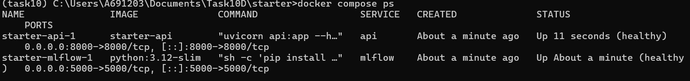
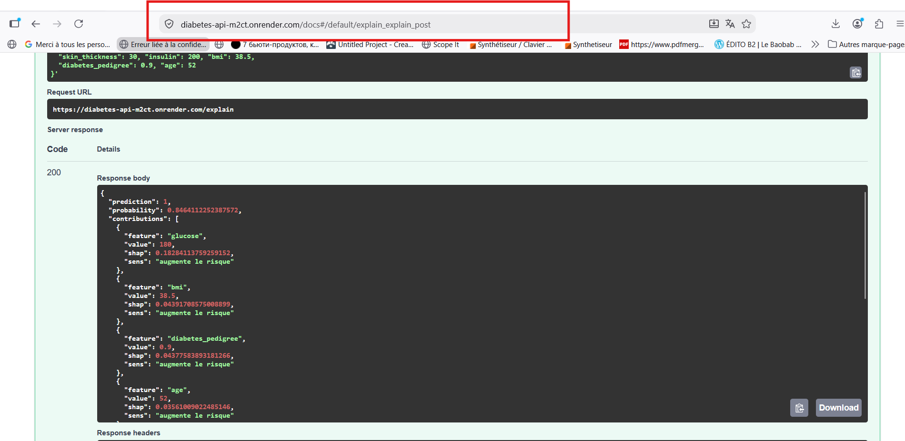
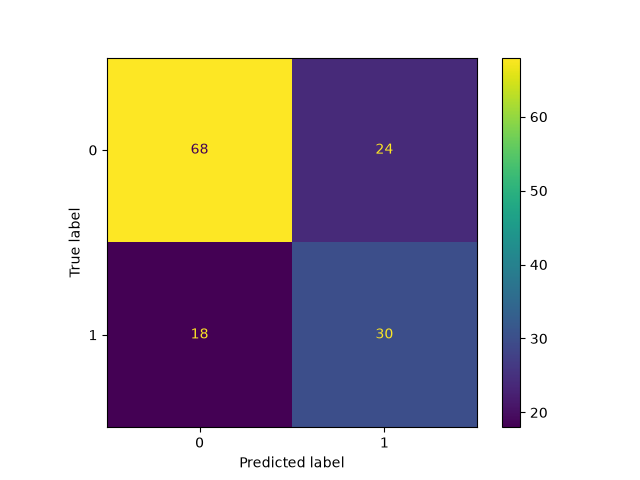
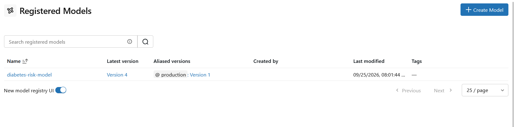
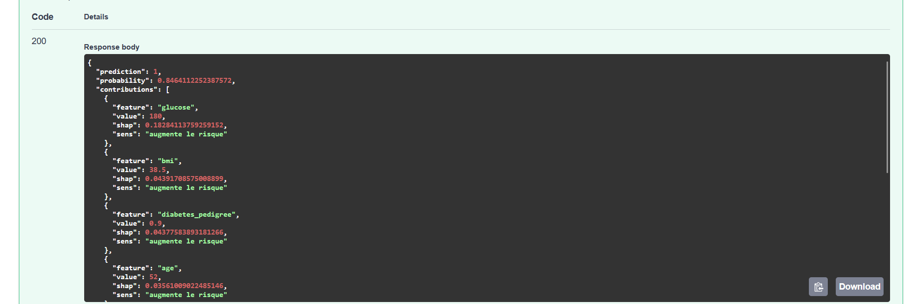
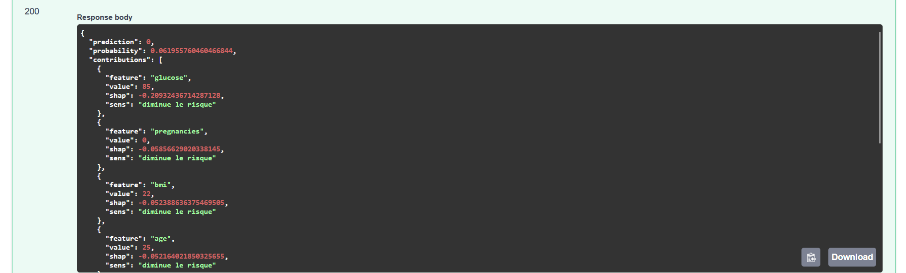
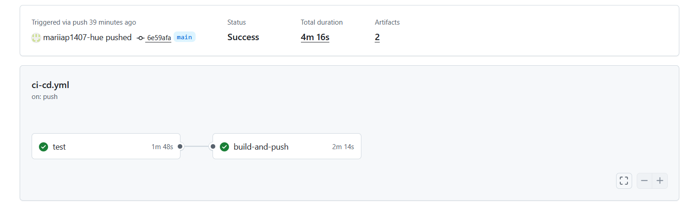
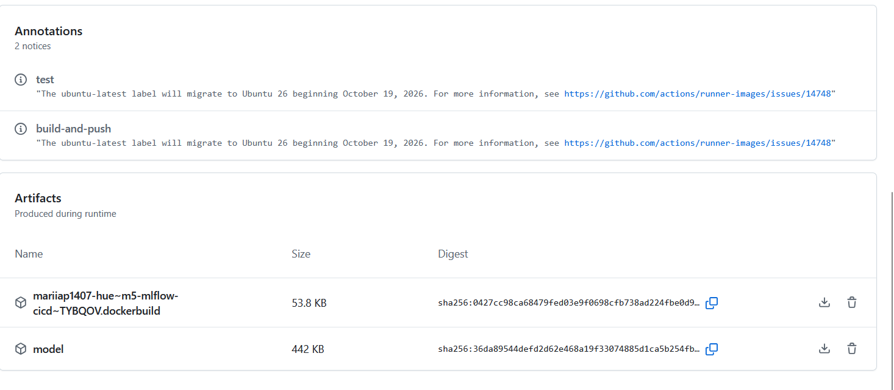
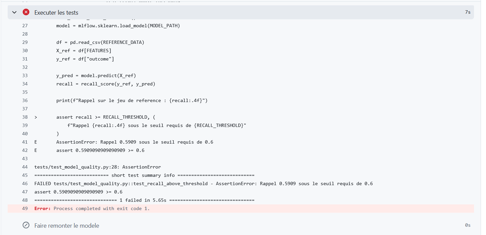
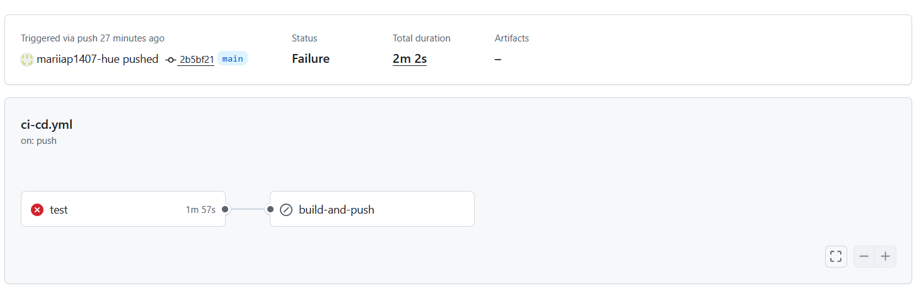

# M5 — Suivi MLflow et intégration continue d'un modèle de classification

Pipeline MLOps complet autour d'un modèle de prédiction du risque de diabète à
partir d'un profil patient (glycémie, IMC, tension, etc.).

Le notebook d'exploration fourni par l'équipe data science a été converti en
script d'entraînement instrumenté avec MLflow, exposé derrière une API FastAPI,
conteneurisé, et placé sous vérification continue avec GitHub Actions.

Le seuil de qualité est fixé : **le rappel sur `data/reference/diabetes_reference.csv`
doit rester supérieur ou égal à 0,60.** Aucune image n'est publiée si ce seuil
n'est pas atteint.

---

## Démarrage rapide

### Prérequis

- Python 3.12
- Docker Desktop
- Un environnement conda ou venv dédié

### Installation

L'environnement local sert au développement, à l'entraînement et aux tests.
Le conteneur Docker ne contient que l'API et le modèle, et suffit pour servir
des prédictions.

```bash
conda create -n task10 python=3.12 -y
conda activate task10
pip install -r requirements.txt
```

### Entraîner le modèle

Démarrer d'abord le serveur MLflow, dans un terminal dédié :

```bash
mlflow server --host 127.0.0.1 --port 5000 --backend-store-uri sqlite:///mlflow.db
```

> Le `--backend-store-uri` n'est pas optionnel : le Model Registry exige un
> backend base de données. Sans lui, MLflow écrit dans le dossier courant, ce
> qui rend le Registry indisponible et disperse les runs selon l'endroit d'où
> la commande a été lancée.

Puis, dans un second terminal :

```bash
python train_model.py
```

L'interface est accessible sur http://127.0.0.1:5000 (onglet **Model training**).

### Lancer l'API seule

```bash
uvicorn api:app --reload --port 8000
```

Documentation interactive : http://127.0.0.1:8000/docs

### Lancer l'ensemble avec Docker

> **Prérequis :** le Dockerfile copie le dossier `model/` dans l'image, et ce
> dossier n'est pas versionné. Il faut donc avoir exécuté `python train_model.py`
> au moins une fois avant de construire l'image, sinon le build échoue sur
> `COPY model/`.

```bash
python train_model.py     # si le dossier model/ n'existe pas encore
docker compose up -d
```

- API : http://localhost:8000
- MLflow : http://localhost:5000

Les deux services déclarent un `healthcheck`, et l'API attend que MLflow soit
réellement prêt (`depends_on: condition: service_healthy`), pas seulement que
son conteneur existe. Le service MLflow installant MLflow à son démarrage,
cette attente dure environ 75 secondes.



### API déployée (bonus 2)

Une instance publique tourne sur Render, à partir de l'image publiée sur
`ghcr.io` — celle-là même qui a passé le quality gate, sans reconstruction :

**https://diabetes-api-m2ct.onrender.com/docs**



L'instance gratuite s'endort après 15 minutes d'inactivité : la première
requête peut prendre une minute.

### Exécuter le test de non-régression

```bash
pytest tests/ -v -s
```

---

## Architecture

```
train_model.py          Entraînement instrumenté MLflow
api.py                  API FastAPI (/health, /predict)
Dockerfile              Image de l'API, modèle embarqué
docker-compose.yml      API + serveur MLflow
tests/
  test_model_quality.py Quality gate : rappel >= 0,60
.github/workflows/
  ci-cd.yml             Pipeline CI/CD
data/
  raw/                  Jeu d'entraînement
  reference/            Jeux d'évaluation (normal et dérivé)
notebooks/              Notebook d'exploration d'origine
```

### Le script d'entraînement

À chaque exécution, `train_model.py` crée dans MLflow :

- **un run parent** portant les meilleurs hyperparamètres, les métriques de test
  (accuracy, rappel, F1, AUC), les quatre cases de la matrice de confusion, et
  la matrice de confusion en image ;
- **36 runs enfants**, un par combinaison de la grille, chacun avec ses
  hyperparamètres et son rappel moyen en validation croisée.



*68 vrais négatifs, 24 faux positifs, 18 faux négatifs, 30 vrais positifs.
Soit un rappel de 30 / (30 + 18) = 0,625 sur le jeu de test interne.*

Le modèle retenu est enregistré au Model Registry sous le nom
`diabetes-risk-model`, avec le stage `Production` et l'alias `production`.
Il est également sauvegardé en local dans `model/`, format que le Dockerfile
copie dans l'image.



*La nouvelle interface MLflow n'affiche plus de colonne « Stage » : la
dépréciation est visible jusque dans l'UI.*

### L'API

Trois endpoints :

| Méthode | Route | Rôle |
|---|---|---|
| GET | `/health` | Vérification de disponibilité (smoke test) |
| POST | `/predict` | Prédiction pour un profil patient |
| POST | `/explain` | Explication SHAP de la prédiction (bonus 1) |

Exemple de requête :

```json
{
  "pregnancies": 2, "glucose": 180, "blood_pressure": 82,
  "skin_thickness": 30, "insulin": 200, "bmi": 38.5,
  "diabetes_pedigree": 0.9, "age": 52
}
```

Réponse :

```json
{ "prediction": 1, "probability": 0.87 }
```

Le chargement du modèle est piloté par deux variables d'environnement, ce qui
permet au même code de fonctionner en local et en conteneur :

| Variable | Défaut | Rôle |
|---|---|---|
| `MLFLOW_TRACKING_URI` | `http://127.0.0.1:5000` | Serveur de tracking |
| `MODEL_URI` | `models:/diabetes-risk-model@production` | Source du modèle |

Dans l'image Docker, `MODEL_URI` vaut `/app/model` : l'API charge le modèle
depuis un fichier embarqué et ne dépend d'aucun serveur MLflow. C'est cette
autonomie qui rend le smoke test possible dans le pipeline.

### L'endpoint `/explain` (bonus 1 — interprétabilité)

`/explain` renvoie la même prédiction que `/predict`, accompagnée de la
contribution de chacune des huit variables, triée par poids décroissant :

```json
{
  "prediction": 1,
  "probability": 0.846,
  "contributions": [
    {"feature": "glucose", "value": 180.0, "shap": 0.1828,
     "sens": "augmente le risque"},
    {"feature": "bmi", "value": 38.5, "shap": 0.0439,
     "sens": "augmente le risque"}
  ]
}
```

Deux détails d'implémentation méritent d'être signalés.

**Le modèle est un pipeline, pas un arbre.** `shap.TreeExplainer` n'accepte que
des modèles à base d'arbres. Le RandomForest est donc extrait du pipeline
(`model.named_steps["model"]`), et les données du patient sont passées dans
l'imputer puis le scaler avant d'être expliquées — mais pas dans
l'undersampler, qui ne s'applique qu'à l'entraînement.

**Les contributions portent sur les données standardisées, les valeurs
affichées sont les valeurs brutes.** Une contribution associée à « glycémie
standardisée de 2,1 » ne se discute pas avec un patient ; « votre glycémie de
180 » si.

Comparaison de deux profils, qui illustre ce que les `feature_importances_`
globales du notebook ne peuvent pas dire :

| Variable | Patient à risque | Patient sain |
|---|---|---|
| glucose | 180 → **+0,183** | 85 → **−0,209** |
| bmi | 38,5 → +0,044 | 22 → −0,052 |
| probabilité | 0,85 | 0,06 |

Même variable, même modèle, effet opposé selon la valeur du patient. C'est la
différence entre une explication **globale** (« la glycémie compte beaucoup en
général ») et une explication **locale** (« pour ce patient, c'est sa glycémie
de 180 qui a décidé »).





### Le pipeline CI/CD

Déclenché à chaque `push`, en deux jobs :

**`test`** — installe les dépendances, exécute `train_model.py`, lance pytest,
puis fait remonter le dossier `model/` via `upload-artifact`.

**`build-and-push`** — déclaré avec `needs: test`, il ne démarre donc que si le
premier job a réussi. Il récupère le modèle via `download-artifact`, construit
l'image Docker, la pousse sur `ghcr.io`, puis démarre cette image et vérifie
que `/health` répond.

Les deux jobs tournent sur des machines séparées, d'où le transit du modèle par
un artifact.

Le job `test` s'exécute avec `MLFLOW_TRACKING_URI: sqlite:///mlflow.db` et
`USE_REGISTRY: "false"` : le runner est éphémère, il n'y a ni serveur de
tracking ni Registry à alimenter.

---

## Choix techniques et justifications

### Rappel plutôt que précision

La métrique d'optimisation (`scoring="recall"` dans le `GridSearchCV`) et le
quality gate portent tous deux sur le rappel. Ce choix vient du coût des
erreurs, pas d'une préférence statistique.

```
rappel    = TP / (TP + FN)    parmi les vrais malades, combien en attrape-t-on ?
précision = TP / (TP + FP)    parmi les alertes, combien étaient justifiées ?
```

Un **faux négatif** est un patient réellement à risque que le modèle déclare
sain : il repart sans dépistage complémentaire, et le coût potentiel est une
complication grave. Un **faux positif** déclenche un examen inutile et un stress
passager. L'asymétrie est nette, et le rappel est la métrique qui pénalise
directement les faux négatifs, puisqu'ils figurent à son dénominateur.

Le compromis est assumé : sur le jeu de test interne, le modèle produit 30 vrais
positifs pour 18 faux négatifs et 24 faux positifs. Le modèle alerte facilement,
ce qui est le comportement souhaité ici.

Ce raisonnement s'inverserait dans d'autres contextes. Pour un filtre anti-spam,
un faux positif — un message important classé en indésirable — coûte plus cher
qu'un spam qui passe : on privilégierait la précision.

À noter que le rappel seul est manipulable : un modèle qui répond
systématiquement « à risque » obtient un rappel parfait de 1,00 et une précision
catastrophique. C'est pourquoi la matrice de confusion est loggée à chaque run :
elle montre les quatre cases simultanément, là où une métrique unique peut
masquer un comportement dégénéré.

L'accuracy aurait été trompeuse ici. Le jeu contient 34 % de positifs : un
modèle qui répondrait toujours « pas à risque » afficherait 66 % d'accuracy
sans rien avoir appris, avec un rappel de 0,00.

### Stages MLflow dépréciés : stage et alias

Le brief demande un stage documenté. Or les **Model Stages sont dépréciés
depuis MLflow 2.9** et seront supprimés dans une future version majeure, au
profit des tags et des alias de version. Ce projet tourne sous MLflow 3.15.2,
où `transition_model_version_stage()` répond encore mais émet un
`FutureWarning`.

Les deux mécanismes ont donc été implémentés :

- `transition_model_version_stage(..., stage="Production")` pour satisfaire
  l'exigence du brief ;
- `set_registered_model_alias(..., alias="production")` parce que c'est la
  pratique actuelle, et parce que l'URI `models:/diabetes-risk-model@production`
  est celle qu'utilise l'API.

Le concept est le même — un nom stable pointant vers une version — mais les
alias sont plus souples : plusieurs alias peuvent coexister sur une version, et
un alias se déplace sans obliger à archiver quoi que ce soit.

### Promotion conditionnelle au Registry

Le quality gate du pipeline empêche la publication d'une image non testée. Mais
en local, rien n'empêchait `train_model.py` de poser l'alias `production` sur un
modèle médiocre : le test pytest s'exécute après l'entraînement, pas pendant.

Le script calcule donc le rappel sur le jeu de référence avant la promotion, et
la refuse sous 0,60 :

```
recall reference: 0.6825
```

Le modèle reste enregistré au Registry dans tous les cas — c'est l'étiquette
`production` qui est conditionnelle. On garde ainsi la trace d'un mauvais modèle
sans le désigner comme référence. La valeur est loggée en métrique
`reference_recall`, ce qui permet d'en suivre l'évolution run après run.

Ce contrôle ne s'exécute pas dans le CI, où `USE_REGISTRY` vaut `false` : c'est
le test pytest qui y joue ce rôle, en amont du build de l'image.

### Épinglage des versions

Les dépendances qui touchent au modèle sont figées dans `requirements.txt` :
`scikit-learn`, `numpy`, `scipy`, `pandas`, `imbalanced-learn`, `skops`,
`mlflow`. Celles qui n'affectent pas les prédictions (FastAPI, uvicorn,
pydantic, pytest, httpx) restent libres.

Ce n'était pas le cas initialement, et deux incidents l'ont imposé :

1. **skops** — la version installée dans le conteneur rejetait
   `sklearn.tree._tree.Tree`, que la version locale acceptait par défaut. Le
   modèle refusait de se charger dans l'image alors qu'il fonctionnait en local.
2. **scikit-learn** — le modèle entraîné avec la 1.9.0 était rechargé par la
   1.9.1 dans le conteneur, produisant un `InconsistentVersionWarning` sur
   chaque étape du pipeline.

Les versions retenues sont celles du fichier `model/requirements.txt` que MLflow
génère à la sauvegarde, et qui décrit exactement l'environnement d'entraînement.

L'enjeu dépasse le confort : sans épinglage, rien ne garantit que le rappel
mesuré par le quality gate dans le CI soit celui mesuré en local. La
reproductibilité d'un entraînement ne se limite pas au `random_state`.

### Sérialisation skops

MLflow 3 sérialise les modèles scikit-learn avec **skops** plutôt que pickle.
Pickle peut exécuter du code arbitraire au chargement ; skops fonctionne par
liste blanche de types autorisés.

Le pipeline de ce projet contient des classes hors scikit-learn, qui doivent
donc être déclarées explicitement à la sauvegarde :

```python
skops_trusted_types=[
    "imblearn.pipeline.Pipeline",
    "imblearn.under_sampling._prototype_selection._random_under_sampler.RandomUnderSampler",
    "numpy.dtype",
    "sklearn.tree._tree.Tree",
]
```

Ces types sont inscrits dans le fichier `MLmodel` et relus automatiquement au
chargement : `load_model()` n'a pas besoin du paramètre.

### Validation des entrées

Le schéma pydantic déclare les huit variables nommées, plutôt qu'une liste de
huit nombres. Un client n'a ainsi pas à connaître l'ordre des colonnes, la
documentation `/docs` est générée automatiquement, et les messages d'erreur
désignent le champ fautif.

Toutes les variables sont déclarées en `float`, y compris celles qui sont
naturellement entières (`age`, `pregnancies`). MLflow avertit qu'une colonne
d'entiers ne peut pas porter de valeur manquante en pandas : si une valeur
venait à manquer, la colonne basculerait en float et la validation de schéma
rejetterait la requête.

Des bornes physiologiques larges ont été posées (`Field(ge=..., le=...)`) pour
écarter les saisies absurdes sans refuser des patients atypiques. Une exception
assumée : les zéros restent autorisés sur `insulin` et `skin_thickness`, alors
qu'ils sont interdits sur `glucose`, `blood_pressure` et `bmi`. La raison est
détaillée ci-dessous.

Ces bornes restent volontairement larges, et donc trop permissives : une
tension de 1 mmHg ou un IMC de 1 passent la validation. Elles écartent les
erreurs de saisie grossières, pas les profils physiologiquement absurdes. En
production, on resserrerait avec de vrais minimums cliniques (tension entre 40
et 200 mmHg, IMC entre 12 et 70).

---

## Limites identifiées

Ces points n'ont pas été corrigés : le brief demande de reproduire fidèlement la
logique du notebook. Ils mériteraient un retour vers l'équipe data science.

### Zéros suspects

Le minimum de `insulin` et `skin_thickness` est 0, valeur physiologiquement
impossible chez un patient vivant. L'hypothèse la plus plausible est qu'il
s'agisse de valeurs manquantes codées en 0, pratique courante sur les jeux
cliniques anciens.

Si c'est le cas, `df.isna()` ne les détecte pas et le
`SimpleImputer(strategy="median")` les traite comme des mesures valides : le
modèle apprend sur des valeurs fausses, tirées vers le bas. La correction
consisterait à les convertir en `np.nan` avant l'imputation.

C'est aussi pourquoi l'API accepte ces zéros : les refuser créerait un écart
entre les données d'entraînement et celles acceptées en production.

### Ambiguïté de `pregnancies`

Le jeu ne comporte aucune colonne indiquant le sexe des patients. Selon la
composition de la cohorte, `pregnancies = 0` pourrait recouvrir des situations
cliniquement distinctes — une femme n'ayant jamais été enceinte, ou un patient
pour qui la variable n'a pas de sens. Information à clarifier auprès de la
source.

### Installation de MLflow au démarrage du conteneur

Le service `mlflow` du `docker-compose.yml` installe MLflow à chaque démarrage,
ce qui ajoute une minute. Un Dockerfile dédié au service de tracking serait plus
propre. Ce raccourci a été retenu pour limiter le nombre d'images à maintenir
dans le périmètre du TP.

---

## Démonstration du quality gate

Le pipeline a été vérifié dans les deux sens.

**Cas nominal** — sur `diabetes_reference.csv`, le rappel est de **0,6825**. Le
test passe, l'image est construite et poussée sur `ghcr.io`, le smoke test
confirme que `/health` répond.





**Cas dégradé** — en pointant temporairement le test sur
`diabetes_reference_drifted.csv`, un jeu dont les profils restent
statistiquement proches mais où le lien entre caractéristiques cliniques et
diabète a évolué, le rappel tombe à **0,5909**.

Le test échoue alors avec un message explicite :

```
AssertionError: Rappel 0.5909 sous le seuil requis de 0.6
```



Le job `build-and-push` est **skipped**, et non pas *failed* : il n'a jamais
démarré, parce que son `needs: test` n'est pas satisfait. Aucune image n'est
construite ni poussée.



*La colonne Artifacts affiche un tiret : rien n'a été produit, pas même le
modèle entraîné.*

C'est le comportement attendu d'un quality gate : la dégradation est détectée
avant la livraison, et l'image publiée sur `ghcr.io` est toujours celle qui
vient de passer la porte.

---

## Livrables

| Fichier | Rôle |
|---|---|
| `train_model.py` | Entraînement instrumenté MLflow (tracking + Registry) |
| `api.py` | API FastAPI exposant le modèle |
| `Dockerfile` | Conteneurisation de l'API |
| `docker-compose.yml` | API + serveur MLflow |
| `tests/test_model_quality.py` | Test de non-régression (seuil 0,60) |
| `.github/workflows/ci-cd.yml` | Pipeline CI/CD |

**Bonus réalisés :** endpoint `/explain` avec `shap.TreeExplainer` (bonus 1) et
déploiement public sur Render depuis l'image `ghcr.io` (bonus 2).
